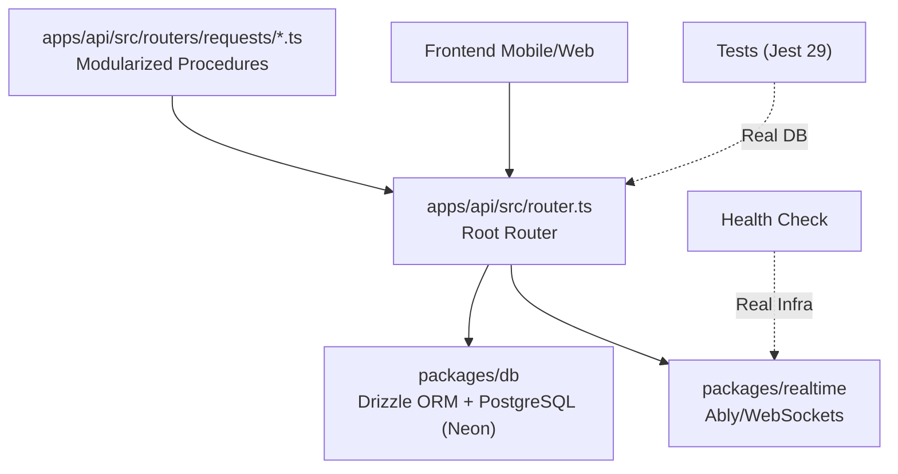

# spec.md — Backend Test Architecture + MOBI-231

## 1. Visão Geral

**Objetivo:** Backend 100% coberto por testes automatizados, pronto para conexão com frontend. Inclui refatoração para Clean Architecture (modularização interna) seguindo TLC/SDD.

**Entrega MOBI-231:** Testar todas as rotas tRPC e casos de uso da API, garantir funcionamento com NeonDB real e estabilizar infraestrutura.

---

## 2. Metodologia: TLC + SDD

### 2.1 TLC (Thought → Logic → Code)

Para cada task, seguir o ciclo:
```
Thought → Entender o que precisa ser feito e por quê
Logic   → Planificar como fazer (etapas, o que pode dar errado)
Code → Implementar apenas após pensar e planar
```

### 2.2 SDD (Spec-Driven Development)

4 fases adaptativas conforme complexidade:

| Fase | Quando |
|------|--------|
| **Specify** | Sempre — definir requisitos com IDs rastreáveis |
| **Design** | Medium/Large — diagramas Mermaid + decisões |
| **Tasks** | Medium/Large — tasks atômicas numeradas |
| **Execute** | Sempre — TDD Red-Green-Refactor |

### 2.3 TDD Cycle (Red-Green-Refactor)

Para cada feature/função:
```
RED → Escrever teste que falha (antes do código)
GREEN → Implementar mínimo para teste passar
REFACTOR → Melhorar código mantendo testes passando
```

---

## 3. Arquitetura Alvo (Revisada)

### 3.1 Diagrama de Camadas (Mermaid)



### 3.2 Decisão Técnica: Modularização Interna
Em vez de extrair para pacotes externos (`domain`/`contracts`) prematuramente, adotamos a modularização dentro da própria API para ganhar velocidade de desenvolvimento e manter a coesão.

---

## 4. Requisitos com IDs

| ID | Requisito | Status | Método |
|----|-----------|--------|--------|
| BACK-01 | Procedures do router `requests` testadas | ✅ DONE | TDD |
| BACK-02 | Procedures do router `profiles` testadas | ✅ DONE | TDD |
| BACK-03 | Procedures de `locations` e `notifications` testadas | ✅ DONE | TDD |
| BACK-07 | Infraestrutura de testes configurada (Jest 29) | ✅ DONE | Setup |
| BACK-09 | Health Check script para validar infra (Neon/Ably) | P0 | Tooling |
| BACK-10 | Modularização do `requestsRouter.ts` em diretório | P0 | Refactor |

---

## 8. Task Breakdown (Próximos Passos)

| ID | Task | Dependencies | Phase | Status |
|----|------|-------------|-------|--------|
| T011 | Setup infraestrutura testes (Jest 29.7) | — | Setup | ✅ DONE |
| T008 | Suite testes — `requests` (106 cenários) | — | Test | ✅ DONE |
| T013 | Script `check-infra.ts` para validação de chaves | — | Tooling | TODO |
| T014 | Refatorar `requests.ts` para `src/routers/requests/` | T008 | Refactor | TODO |

---

## 11. Gray Areas & Decisions (REVISADO)

| Decision | Escolha | Rationale |
|----------|---------|-----------|
| **Contratos inline vs extraction** | **Modularizado (Inline Folder)** | Quebrar em arquivos dentro da API em vez de pacotes externos para velocidade. |
| **Mock vs real realtime nos testes** | Mock via REALTIME_PROVIDER=mock | Determinístico e rápido. Validação real via script separado. |
| **Drizzle mock** | **Real DB (Neon) + execTx** | 100% fiel à produção com fallback de transação para o driver HTTP. |
| **Test framework** | **Jest 29.7.0** | Estável e integrado com o monorepo. |

---

## 12. Riscos e Mitigações

| Risco | Impacto | Mitigação |
|-------|---------|-----------|
| Erro em chaves de produção | Médio | BACK-09 (Health check script) antes de conectar o front. |
| Arquivos gigantes (>500 linhas) | Baixo | BACK-10 (Modularização do requests router). |
