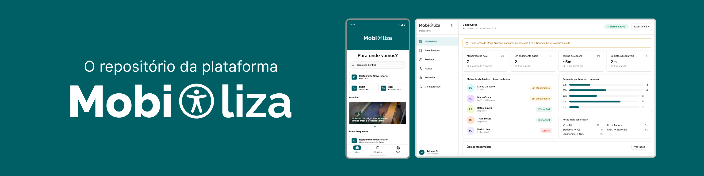
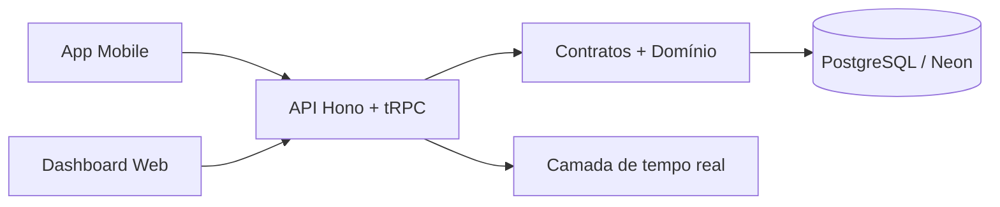

<picture>
   <source media="(prefers-color-scheme: dark)" srcset="./.github/cover_dark.png">
   <source media="(prefers-color-scheme: light)" srcset="./.github/cover.png">
   
</picture>

## ✨ Visão geral

Este monorepo reúne os principais serviços e aplicações da plataforma, com foco em atendimento, gestão e estruturação de dados para o ecossistema do projeto Mobiliza.

A base atual do repositório inclui:

* uma aplicação mobile para uso em campo e operação
* um dashboard web para gestão e acompanhamento
* um backend HTTP para orquestração de rotas, autenticação e integrações
* pacotes compartilhados para domínio, contratos, ambiente, banco e tempo real

---

## 🧩 Estrutura do monorepo

### Apps

* `apps/api` — servidor HTTP com Hono, tRPC e Better Auth
* `apps/mobile` — aplicação mobile em Expo / React Native
* `apps/web` — dashboard web em Next.js

### Packages

* `packages/auth` — autenticação compartilhada com Better Auth
* `packages/contracts` — contratos e schemas compartilhados com Zod
* `packages/db` — acesso ao banco com Drizzle ORM e PostgreSQL
* `packages/domain` — regras de negócio e casos de uso
* `packages/env` — validação e centralização de variáveis de ambiente
* `packages/realtime` — integrações de tempo real e canais externos

### Configurações compartilhadas

* `config/typescript` — presets de TypeScript para o monorepo
* `biome.json` — configuração de lint e formatação
* `turbo.json` — pipeline do Turborepo

---

## 🛠️ Tecnologias principais

| Camada | Tecnologias |
| --- | --- |
| Mobile | Expo, React Native, Expo Router, NativeWind |
| Web | Next.js, React, tRPC, React Query |
| Backend | Node.js, Hono, tRPC, Better Auth |
| Dados | Drizzle ORM, PostgreSQL, Neon |
| Compartilhamento | Zod, TypeScript, pacotes internos |

---

## 🚀 Como rodar localmente

1. Instale as dependências:

```bash
pnpm install
```

2. Configure as variáveis de ambiente conforme o template na raiz:

```bash
cp .env.example .env
```

3. Execute o ambiente de desenvolvimento:

```bash
pnpm dev
```

---

## 🌍 Variáveis de ambiente

Para o desenvolvimento local, as variáveis de ambiente devem ser definidas em um arquivo `.env` na raiz do projeto, seguindo o modelo disponível em [`.env.example`](.env.example).

O pacote [`packages/env`](packages/env) é o responsável por carregar e validar essas variáveis a partir do `.env` da raiz, utilizando `dotenv` e `zod`.  
As aplicações e pacotes do monorepo importam as variáveis exclusivamente pelos módulos públicos deste pacote (`@mobiliza/env`, `@mobiliza/env/api`, `@mobiliza/env/auth`, etc.), evitando acesso direto a `process.env`.

> [!NOTE] 
> Em ambientes hospedados (produção, staging, etc.), a configuração das variáveis de ambiente é abstraída automaticamente pelos serviços de cloud ou pelo provedor de deploy — não sendo necessário manter um arquivo `.env` local nesses casos.

---

## 📦 Scripts disponíveis

Na raiz do projeto, os comandos principais são:

```bash
pnpm build
pnpm dev
pnpm lint
pnpm check-types
pnpm format-and-lint
pnpm format-and-lint:fix
```

---

## 🧹 Cleanup (reinstalação de dependências)

Caso enfrente problemas com dependências quebradas ou inconsistentes, execute os comandos abaixo para limpar os vestígios de instalações anteriores e reinstalar tudo do zero:

```bash
find . \( -name "node_modules" -o -name ".turbo" -o -name "dist" -o -name "build" \) -type d -prune -exec rm -rf '{}' +
pnpm store prune
pnpm install
```

> [!WARNING] 
> Os comandos acima removem completamente os diretórios `node_modules`, `.turbo`, `dist` e `build` de todo o monorepo, e em seguida limpam o cache global de pacotes do pnpm. Depois disso, uma nova instalação é feita.

---

## 🗄️ Banco de dados

O projeto utiliza PostgreSQL com Drizzle ORM, e o pacote `packages/db` concentra a camada de acesso ao banco.

Fluxo esperado:

* configurar `DATABASE_URL` na raiz
* manter o schema dentro de `packages/db`
* usar os scripts de migração e geração quando houver mudanças estruturais

---

## 🔌 Arquitetura em alto nível



---

## 🤝 Direção do projeto

Este repositório foi organizado com a ideia de manter a lógica compartilhada fora das aplicações e deixar cada app com sua responsabilidade clara.

Nos READMEs individuais, cada pacote e aplicação tem sua própria documentação com detalhes de execução, escopo e decisões de implementação.

---


---

## 📄 Licença

Consulte o arquivo [LICENSE](LICENSE) para os termos de uso do projeto.
