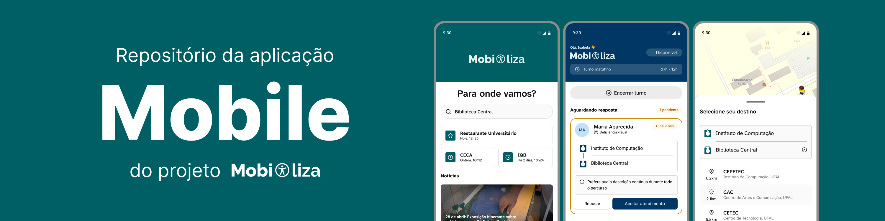

<picture>
  <source media="(prefers-color-scheme: dark)" srcset="../../.github/mobile/cover_dark.png">
  <source media="(prefers-color-scheme: light)" srcset="../../.github/mobile/cover.png">
  
</picture>

## Aplicação mobile

A aplicação mobile do Mobiliza é a interface voltada para estudantes e bolsistas. Ela concentra os fluxos operacionais do serviço e usa Expo com React Native para oferecer uma base única para Android, iOS e web.

### O que este app cobre

* navegação por rotas com Expo Router
* telas e componentes acessíveis
* integração com a API do projeto via tRPC
* uso de mapas, formulários e estados de operação
* integração com bibliotecas nativas quando necessário

### Stack principal

| Camada | Tecnologia |
| --- | --- |
| Runtime | Expo |
| UI | React Native |
| Rotas | Expo Router |
| Estilo | NativeWind + Tailwind |
| Formulários | React Hook Form + Zod |

### Estrutura esperada

```text
apps/mobile/
   src/
      app/         -> rotas e layouts
      components/  -> componentes reutilizáveis
      hooks/       -> hooks compartilhados
      lib/         -> clientes e utilitários
      services/    -> integrações externas
      schemas/     -> schemas locais
```

### Como rodar

```bash
pnpm install
pnpm start
```

> [!NOTE]
> Caso perceba inconsistências visuais ou erros de build não relacionado ao código, tente limpar o cache do Expo com `npx expo start --clear`

### Troubleshooting

* para problemas de dependências nativas, rode `expo doctor` e siga as instruções
* consulte os logs do Expo para erros específicos de build ou runtime

### Observações

* a maior parte da lógica compartilhada deve vir de `@mobiliza/contracts`, `@mobiliza/domain`, `@mobiliza/env` e `@mobiliza/realtime`
* o código da app deve priorizar experiência e acessibilidade
* o diretório `src/app` é o ponto principal das rotas
