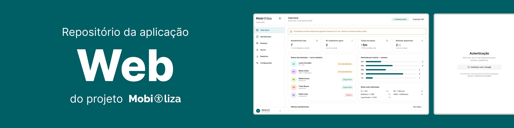

<picture>
  <source media="(prefers-color-scheme: dark)" srcset="../../.github/web/cover_dark.png">
  <source media="(prefers-color-scheme: light)" srcset="../../.github/web/cover.png">
  
</picture>

## Dashboard web

O app `web` é o painel de gestão do Mobiliza. Ele concentra a visualização operacional, os formulários administrativos e os relatórios usados pela equipe responsável pelo serviço.

### Responsabilidades

* exibir dados operacionais em tempo real
* concentrar ações de gestão e acompanhamento
* consumir a API tipada do backend
* reutilizar componentes visuais padronizados

### Stack principal

| Camada | Tecnologia |
| --- | --- |
| Framework | Next.js |
| UI | React |
| Estado de dados | React Query + tRPC |
| Estilo | Tailwind CSS |
| Componentes | shadcn/ui e bibliotecas auxiliares |

### Estrutura esperada

```text
apps/web/
	app/          -> rotas do App Router
	components/   -> componentes reutilizáveis
	lib/          -> utilitários do cliente e do servidor
	providers/    -> providers globais
	data/         -> dados mockados e fontes locais
```

### Como rodar

```bash
pnpm install
pnpm dev
```

### Observações

* a interface deve conversar com `apps/api`
* autenticação e sessão devem usar os pacotes compartilhados
* a maior parte dos elementos visuais fica em `components/`
